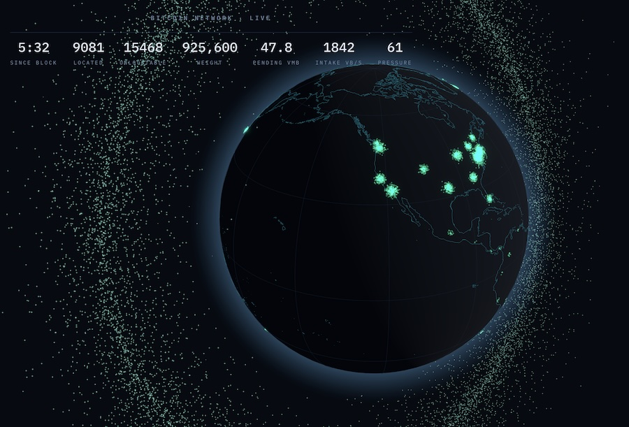

# Bitcoin Globe

A real-time 3D visualization of the Bitcoin network — the physical machines that carry it, the transactions flowing between them, and the ten-minute heartbeat of consensus.

It is built on one rule: **the aesthetic is the information.** Every moving, glowing thing on screen is driven by real data, and nothing is invented to make the picture prettier or more dramatic than the network actually is. Several of the most interesting things about this visualization are consequences of refusing to fake anything.

---

## What it shows

| Layer | What it is | Encoding |
|---|---|---|
| **Node globe** | Reachable Bitcoin nodes with a locatable IP | Pale green points at real lat/lng |
| **Unlocatable halo** | Reachable nodes with **no** coordinates (Tor) | Pale green points in a tumbling off-globe band |
| **Transaction stream** | Each transaction as it enters the mempool | Size ← vsize · Colour ← feerate (yellow → orange → dark orange) |
| **Atmosphere** | Aggregate mempool pressure | Fresnel shell brightness ← pending vBytes + intake rate |
| **Block heartbeat** | A block being mined | Warm gold flare across all nodes + expanding shockwave |
| **Sunlight** | Real time of day | Directional light at the true subsolar point |
| **Telemetry** | Live figures | Located · unlocatable · height · pending vMB · tx/s · sat/vB · since block |

---

## The honest encoding

These aren't stylistic choices. Each one is a decision about what the data can and cannot truthfully say.

### Geography exists for machines, not for money

Bitcoin transactions have **no location**. A transaction is inputs, outputs, and scripts — there is no country, no city, no IP anywhere in the blockchain. Visualizations that show transactions "lighting up around the globe" are showing decorative fiction.

Nodes are different: they're physical machines with IP addresses that can be geolocated. So the globe is the network's **body**, and everything without a location lives *off* the globe by construction:

- **Nodes** → placed on the sphere at real coordinates.
- **Unlocatable nodes** → a band around the globe, uniformly random, tumbling on drifting axes. Any position on it is meaningless *by design* — the motion exists so no fixed frame can be read into it.
- **Transactions** → motes drifting in the abstract volume between globe and halo. Position carries no information.

### Size is vsize. Colour is feerate. Value is never encoded.

A transaction moving 500 BTC and one moving 5,000 sats look **identical** if their vsize and feerate match. That's deliberate. A miner assembling a block runs a knapsack over feerate against the 4,000,000 weight-unit ceiling — the amount of money moved is not an input to that decision anywhere. So the two things that decide inclusion are the two things drawn:

- **size ← vsize** — how much block space it consumes (driven by input/output count, not amount)
- **colour ← feerate** — what it pays per unit of that space

The amount transferred appears nowhere in the visuals. A big dark-orange mote is a *large transaction paying a high rate* — usually a consolidation or an inscription — not a whale moving a fortune.

### Nothing predicts a block, because nothing can

Mining is memoryless. Every hash is an independent lottery ticket, so if nine minutes have passed since the last block, the expected wait for the next one is still ten minutes. There is no signal — not in fees, not in mempool depth, not in hashrate — that indicates a block is *about to* happen.

So there is **no countdown and no crescendo**. The atmosphere tracks congestion, which is uncorrelated with block timing. The telemetry shows *time since* the last block, never time until. The pulse arrives unannounced. That unpredictability isn't a gap in the visualization — it *is* the phenomenon.

### Weight, not megabytes

Block fullness is `weight / 4,000,000`, not size in MB. SegWit discounts witness data, so a block is full at 4M weight units regardless of whether that lands at 1.6 MB or 2.1 MB.

### Motes die when a block confirms them, not on a timer

A transaction's real lifetime runs from arrival to confirmation — an *event*, not a duration. Each block reports `feeRange[0]`, the lowest feerate it included; miners fill greedily by feerate, so every pending mote at or above that threshold flares and vanishes at the pulse. The cool low-fee stragglers keep drifting, still waiting — because in reality, they are.

### The visualization discloses its own blind spots

- The transaction feed is a **rolling window**, not a firehose. During bursts, arrivals are missed — the `tx/s` stat labels itself `·sampled` when it detects saturation.
- `feeRange[0]` is a good approximation, but CPFP and package relay mean a low-fee transaction can ride in on a high-fee child.
- The mote swarm holds a few thousand transactions against a real backlog of ~250,000. It's a window on **arrivals**, never the whole mempool.

---

## What it teaches

Watch it long enough and it argues with several things people believe about Bitcoin.

**Most of the network is invisible.** Around **63% of reachable nodes are unlocatable** — Tor, no coordinates. The halo isn't a footnote; it outnumbers everything on the globe. And that's only the *reachable* network: the majority of all nodes sit behind NAT, accept no incoming connections, and cannot be enumerated by anyone. The globe shows the observable minority of an observably larger whole.

**The visible part is a map of data centres, not of people.** The dense clusters are Ashburn, Falkenstein, Amsterdam, Helsinki — where cheap hosting lives, not where Bitcoin enthusiasts do. Someone in Caracas running a node on a New Jersey droplet appears as a New Jersey node. The map systematically relocates operators to their servers.

**Nodes are not miners.** Mining hashpower and node geography barely overlap. Countries famous for mining can show almost no nodes, because a miner points hashrate at a *pool*, and the pool's node lives in a data centre somewhere else entirely.

**There is no rhythm to find.** The most valuable thing the piece can teach is that the pattern you're looking for doesn't exist. Quiet minutes yield nothing; busy minutes yield instant blocks; and vice versa. You learn memorylessness by watching it refuse to resolve.

**And the honesty is what reveals it.** None of these insights were designed in. They fell out of a rule — *show only what the data actually says* — and the network turned out to be more interesting than the marketing version.

---

## Tech stack

| Layer | Technology |
|---|---|
| Frontend framework | React 19 + TypeScript |
| 3D rendering | Three.js via `@react-three/fiber` |
| Post-processing | `@react-three/postprocessing` (bloom) |
| 3D helpers | `@react-three/drei` |
| Build tool | Vite |
| Styles | Sass |
| Backend runtime | Node.js + TypeScript (`tsx`) |
| Backend transport | WebSockets (`ws`) |
| Data sources | [mempool.space](https://mempool.space) WebSocket · [Bitnodes](https://bitnodes.io)-format node snapshot |
| Geo data | `world-atlas` + `topojson-client` |
| Solar position | NOAA subsolar-point approximation (no API) |
| Monorepo | npm workspaces |

### Architecture

Two tempos share one render loop:

- **Continuous** — mempool state arrives every 1–2s and is *damped* toward each frame, so stepwise data breathes instead of snapping.
- **Discrete** — block events spawn animations with their own lifecycle: born, animated, retired.

Per-frame state lives in refs, never React state — the render loop never triggers a re-render. External API shapes are normalized to domain types at a single boundary (`shared/normalize.ts`), so a data source can change without anything downstream noticing.

---

## Data sources & current status

**Live:** mempool.space's WebSocket supplies mempool stats, the transaction stream, and block events.

**Node data:** the long-running bitnodes.io crawler's domain expired in May 2026 and the API is currently unreachable. The app is source-agnostic — `backend/src/sources/bitnodes.ts` accepts either a live Bitnodes-format HTTP endpoint or a local fixture, and only that one file changes when a live source is restored.

Development currently runs against a **clearly-labelled synthetic fixture** (`scripts/make-fixture.ts`). Its *counts and country proportions are real* — taken from the last published Bitnodes snapshot (24,557 reachable, 62.99% `.onion`, US 2695 / DE 1241 / FR 678 …) — but the individual nodes are invented and use reserved non-routable IP ranges. The snapshot file states this in its own `_comment` field, and the backend logs the provenance of every load (`live` / `cache` / `fixture`) so it's never ambiguous what you're looking at.

When a live source is wired, note that Bitnodes rate-limits unauthenticated requests to ~10/day; the source module caches snapshots to disk and persists a daily request count to stay under it.

---

## Project structure

```
bitcoin-globe/
├── shared/          # Types + normalization — imported by both sides, imports neither
├── backend/         # Node WebSocket gateway — node snapshots, mempool.space relay
│   ├── src/sources/ # The outside-world boundary: fetch, validate, normalize
│   ├── scripts/     # make-fixture.ts — synthetic snapshot generator
│   └── fixtures/
└── frontend/        # React + Three.js
    └── src/scene/   # Globe · Coastlines · Atmosphere · Heartbeat ·
                     # UnlocatableHalo · TransactionStream · SunLight · Starfield
```

## Prerequisites

- Node.js 20+
- npm 10+

## Install

```bash
npm install
```

Installs the root workspace and all packages (`shared`, `backend`, `frontend`).

## Run

Two terminals, from the project root:

```bash
# Terminal 1 — backend (WebSocket gateway on port 8787)
npm run dev:backend

# Terminal 2 — frontend (Vite dev server)
npm run dev:frontend
```

Then open [http://localhost:5173](http://localhost:5173).

Press **`b`** to fire a test block pulse without waiting ~10 minutes for a real one. (Dev only — the flare and shockwave fire, but no transactions are harvested, since there's no real block to harvest against.)

## Build

```bash
npm run build -w frontend
```

Static output is written to `frontend/dist/`.
